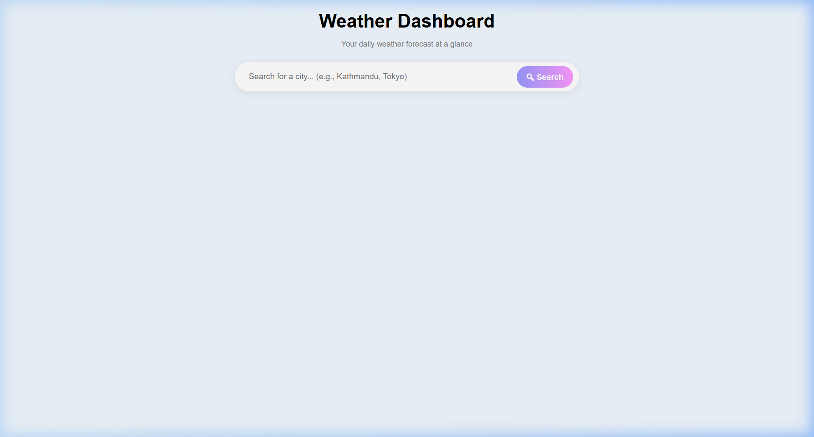
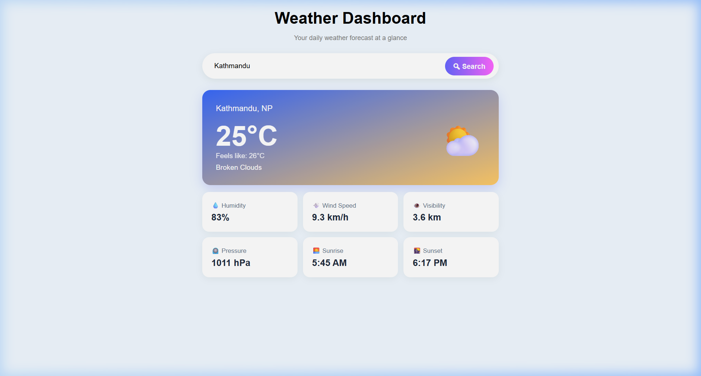
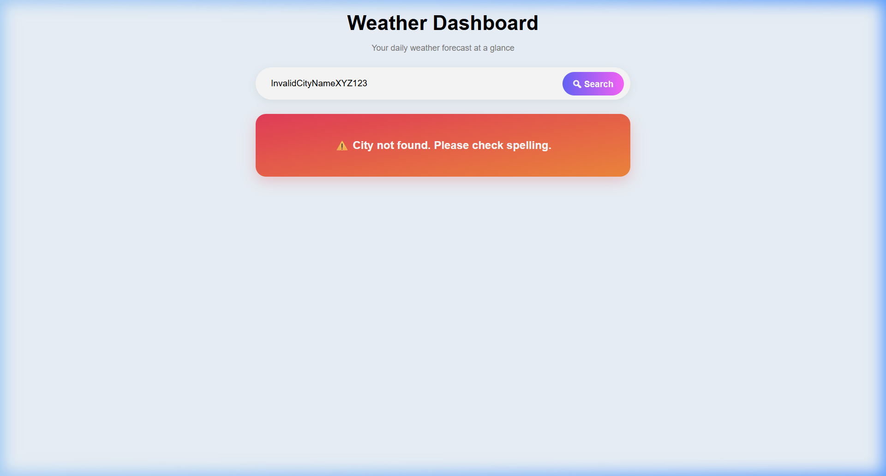

<div align="center">

# ⛅ Weather Dashboard

**A clean, responsive, and real-time weather web application providing instant forecasts and comprehensive meteorological insights at a glance.**

[](https://opensource.org/licenses/MIT)
[](https://developer.mozilla.org/en-US/docs/Web/HTML)
[](https://developer.mozilla.org/en-US/docs/Web/CSS)
[](https://developer.mozilla.org/en-US/docs/Web/JavaScript)
[](https://openweathermap.org/api)

[About](#-about) • [Screenshots](#-screenshots) • [Features](#-features) • [Design System](#-design-system--aesthetics) • [Project Structure](#-project-structure) • [Tech Stack](#️-tech-stack) • [Installation & Setup](#️-installation--setup) • [Available Scripts](#-available-scripts) • [License](#-license)

</div>

---

## 📖 About

The **Weather Dashboard** is a lightweight, modern web application built using pure Vanilla JavaScript, HTML5, and CSS3. It empowers users to search for real-time weather conditions in any city across the globe via the OpenWeatherMap API.

Designed with simplicity, speed, and elegance in mind, the application displays essential weather metrics—such as real-time temperature, "feels like" thermal perception, atmospheric pressure, wind speed, humidity, visibility, and localized sunrise/sunset times—all wrapped in an eye-catching, responsive user interface.

Whether you're planning your day, heading out for travel, or curious about the climate in distant cities, the Weather Dashboard delivers accurate atmospheric data with zero bloat and near-instant loading speeds.

---

## 📸 Screenshots

Here is a visual walkthrough of the three primary user interface states:

### 1. Initial UI (Landing View)
> Clean and minimal search interface welcoming the user to look up any city.

<div align="center">
  
</div>

<br/>

### 2. After Searching (Weather Forecast View)
> Comprehensive weather card displaying temperature, condition icon, and a detailed 6-metric atmospheric grid.

<div align="center">
  
</div>

<br/>

### 3. Error State (Invalid City / Network Issue)
> Informative and user-friendly error card alerting the user when a city cannot be found or invalid input is given.

<div align="center">
  
</div>

---

## ✨ Features

- 🌍 **Global City Search:** Search for any municipality or city worldwide and retrieve instant weather data.
- 🌡️ **Temperature & "Feels Like" Display:** Clear presentation of current Celsius temperature alongside human-perceived temperature.
- 🌤️ **Dynamic Weather Condition Emojis:** Intelligently maps OpenWeather condition codes to expressive weather emojis (☀️ Sunny, 🌧️ Rain, 🌦️ Shower, ⛈️ Thunderstorm, ❄️ Snow, 🌫️ Mist/Atmosphere, ⛅ Clouds).
- 📊 **Comprehensive 6-Point Meteorological Grid:**
  - 💧 **Humidity:** Relative atmospheric moisture percentage.
  - 💨 **Wind Speed:** Converted dynamically from meters per second to kilometers per hour (`km/h`).
  - 👁️ **Visibility:** Converted to kilometers (`km`) for quick readability.
  - ⏲️ **Pressure:** Barometric pressure measured in hectopascals (`hPa`).
  - 🌅 **Sunrise & 🌇 Sunset:** Calculated using timezone offsets and formatted into clean 12-hour AM/PM local times.
- ⏳ **Search Feedback Indicator:** Disables the button and displays a loading state (`⏳ Searching...`) during API calls to prevent duplicate submissions.
- 🛡️ **Robust Error Handling:**
  - Handles empty inputs with instant validation warnings.
  - Handles `404 Not Found` for misspelled or nonexistent cities.
  - Handles `401 Unauthorized` for invalid or missing API keys.
  - Gracefully recovers on network failure or unexpected API responses.
- 📱 **Fully Responsive Layout:** Optimized across mobile screens, tablets, and wide desktop displays.

---

## 🎨 Design System & Aesthetics

The design of the Weather Dashboard focuses on modern minimalism, smooth gradients, soft shadows, and responsive visual hierarchy:

| Element | Specification & Values | Description |
| :--- | :--- | :--- |
| **Background** | `hsl(208, 100%, 97%)` | Soft, ambient ice-blue canvas providing high contrast and calm visual comfort. |
| **Main Card Gradient** | `linear-gradient(to bottom right, hsl(225, 95%, 60%), hsl(39, 100%, 70%))` | Vibrant sky-blue to warm sunset-amber gradient symbolizing atmospheric light. |
| **Error Card Gradient** | `linear-gradient(to bottom right, hsl(350, 80%, 58%), hsl(25, 90%, 60%))` | Warm coral-red to amber gradient for clear yet non-jarring alert feedback. |
| **Search Button** | `linear-gradient(to right, hsl(240, 100%, 80%), hsl(300, 100%, 80%))` | Lilac-to-magenta pill button with hover transitions and micro-interactions. |
| **Typography** | `font-family: Arial, Helvetica, sans-serif` | Clean, universally accessible sans-serif font stack. |
| **Fluid Scaling** | `clamp()` values for font sizes and padding | Ensures seamless readability across both mobile phones (`320px`) and large monitors (`1920px+`). |
| **Cards & Shadows** | `border-radius: 15px - 50px`, `box-shadow: 0 4px 15px rgba(0,0,0,0.05)` | Soft elevations creating a clean, layered card hierarchy. |
| **Responsive Grid** | CSS Grid (`3 columns` → `2 columns` @ 768px → `1 column` @ 480px) | Adapts automatically to device screen width. |

---

## 📁 Project Structure

```text
Weather-App/
├── index.html          # Semantic HTML document defining layout, forms, and containers
├── style.css           # Vanilla CSS stylesheet containing design system, layout, and media queries
├── script.js           # Core JavaScript logic handling API requests, timezone math, and DOM updates
├── image.webp          # Application shortcut icon / favicon
├── screenshots/        # Application preview images utilized in documentation
│   ├── initial-ui.png      # Screenshot of the landing interface
│   ├── weather-result.png  # Screenshot after successful weather data retrieval
│   └── error-state.png     # Screenshot illustrating error handling
└── README.md           # Comprehensive project documentation
```

### File Breakdown:
- **`index.html`**: Structures the dashboard header, city search form, weather summary card, and metrics grid.
- **`style.css`**: Powers the visual aesthetics—gradient cards, pill search bar, fluid typography, and responsive media queries.
- **`script.js`**: Contains asynchronous API communication (`fetch`), response parsing, timezone conversion helper (`formatSunTime`), emoji classification (`getWeatherEmoji`), and dynamic DOM rendering.

---

## ⚙️ Tech Stack

- **Markup:** [HTML5](https://developer.mozilla.org/en-US/docs/Web/HTML) (Semantic elements, accessibility considerations)
- **Styling:** [CSS3](https://developer.mozilla.org/en-US/docs/Web/CSS) (Vanilla CSS, CSS Grid, Flexbox, Gradients, `clamp()` fluid sizing)
- **Scripting:** [JavaScript (ES6+)](https://developer.mozilla.org/en-US/docs/Web/JavaScript) (`async/await`, Fetch API, Object destructuring, DOM manipulation)
- **Weather Data Service:** [OpenWeatherMap Current Weather API](https://openweathermap.org/current)

---

## 🛠️ Installation & Setup

Because this project is built entirely with pure vanilla technologies, no package manager, compiler, or build step is required!

### 1. Clone the Repository
Open your terminal or command prompt and clone the project:
```bash
git clone https://github.com/rahulsingh2007/Weather-Display-Site.git
cd Weather-Display-Site
```

### 2. Configure Your API Key
1. Sign up for a free account at [OpenWeatherMap](https://home.openweathermap.org/users/sign_up).
2. Generate a free API key from your [API Keys page](https://home.openweathermap.org/api_keys).
3. Open [`script.js`](script.js) and update the `apiKey` constant with your key:
   ```javascript
   const apiKey = "YOUR_OPENWEATHERMAP_API_KEY";
   ```

### 3. Launch the Application
Simply open `index.html` in your favorite web browser!

---

## 🏃‍♂️ Available Scripts

Since this is a lightweight Vanilla JS project, there are multiple zero-friction ways to run and develop the project:

### Option 1: Direct File Launch (No dependencies needed)
- **Double click** the `index.html` file in your file explorer, or
- Drag and drop `index.html` directly into any web browser window (Chrome, Firefox, Edge, Safari).

### Option 2: Using VS Code "Live Server" (Recommended for development)
1. Install the [Live Server Extension](https://marketplace.visualstudio.com/items?itemName=ritwickdey.LiveServer) in VS Code.
2. Right-click `index.html` and select **"Open with Live Server"**.
3. The app will automatically open at `http://127.0.0.1:5500` with automatic hot-reloading on file edits.

### Option 3: Using Node.js HTTP Servers (Optional)
If you have Node.js installed and prefer a local development server via terminal:

- **Using `npx serve`:**
  ```bash
  npx serve .
  ```
- **Using `npx http-server`:**
  ```bash
  npx http-server -c-1 -o
  ```

---

## 📝 License

This project is licensed under the **MIT License** - see the [LICENSE](LICENSE) file or the summary below for details:

```text
MIT License

Copyright (c) 2026 Rahul Singh

Permission is hereby granted, free of charge, to any person obtaining a copy
of this software and associated documentation files (the "Software"), to deal
in the Software without restriction, including without limitation the rights
to use, copy, modify, merge, publish, distribute, sublicense, and/or sell
copies of the Software, and to permit persons to whom the Software is
furnished to do so, subject to the following conditions:

The above copyright notice and this permission notice shall be included in all
copies or substantial portions of the Software.

THE SOFTWARE IS PROVIDED "AS IS", WITHOUT WARRANTY OF ANY KIND, EXPRESS OR
IMPLIED, INCLUDING BUT NOT LIMITED TO THE WARRANTIES OF MERCHANTABILITY,
FITNESS FOR A PARTICULAR PURPOSE AND NONINFRINGEMENT. IN NO EVENT SHALL THE
AUTHORS OR COPYRIGHT HOLDERS BE LIABLE FOR ANY CLAIM, DAMAGES OR OTHER
LIABILITY, WHETHER IN AN ACTION OF CONTRACT, TORT OR OTHERWISE, ARISING FROM,
OUT OF OR IN CONNECTION WITH THE SOFTWARE OR THE USE OR OTHER DEALINGS IN THE
SOFTWARE.
```

---

<div align="center">
  Made with ☀️ and 💻 by Rahul Singh
</div>
